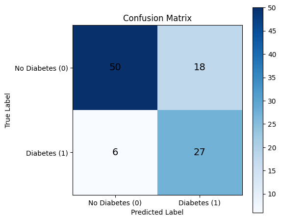

# 🩺 Healthcare Diabetes Dataset

ชุดข้อมูลนี้เกี่ยวกับปัจจัยสุขภาพของผู้ป่วยโรคเบาหวาน ที่จะนำมาใช้ในการวิเคราะห์ปัจจัยที่มีผลต่อการเกิดโรคเบาหวาน

##  Data Dictionary

| Attribute | Description | Data Type | Valid Range / Example |
|---------|------------|-----------|----------------------|
| **Id** | รหัสระบุข้อมูลแต่ละแถว | Nominal | 1, 2, 3, … |
| **Pregnancies** | ประวัติการตั้งครรภ์ (จำนวนครั้งที่ตั้งครรภ์)| Ratio (Discrete) | [0, ∞) |
| **Glucose** | ระดับน้ำตาลในเลือด ภายหลังการดื่มน้ำเชื่อมกลูโคสประมาณ 2 ชั่วโมง เพื่อวัดความสามารถในการจัดการน้ำตาลในเลือด (Oral Glucose Tolerance Test - OGTT) หน่วย: มิลลิกรัมต่อเดซิลิตร (mg/dL) | Ratio (Continuous) | [0, ∞) |
| **BloodPressure** | ความดันโลหิตขณะหัวใจคลายตัว (Diastolic) หน่วย: มิลลิเมตรปรอท(mm Hg) | Ratio (Continuous) | [0, ∞) |
| **SkinThickness** | ความหนาของชั้นไขมันใต้ผิวหนังบริเวณต้นแขน (Triceps) หน่วย: มิลลิเมตร(mm) | Ratio (Continuous) | [0, ∞) |
| **Insulin** | ระดับอินซูลินในเลือดที่วัดภายหลังการดื่มน้ำเชื่อมกลูโคสประมาณ 2 ชั่วโมง(ในการทดสอบ OGTT) หน่วย: ไมโครยูนิตต่อมิลลิลิตร(mu U/ml) ค่าสูงขึ้นบ่งชี้ถึงภาวะดื้ออินซูลินที่รุนแรงขึ้นเรื่อยๆ | Ratio (Continuous) | [0, ∞) |
| **BMI** | ดัชนีมวลกาย (น้ำหนักเป็น กก. / ส่วนสูงเป็น ม.^2) | Ratio (Continuous) | [0, ∞) |
| **DiabetesPedigreeFunction** | ฟังก์ชันลำดับเครือญาติโรคเบาหวาน สะท้อนความเสี่ยงทางพันธุกรรม ซึ่งเป็นคะแนนทางพันธุกรรมของโรคเบาหวาน | Ratio (Continuous) | [0, ∞) |
| **Age** | อายุ (ปี) | Ratio (Discrete) | [0, ∞) |
| **Outcome** | การจำแนกประเภทของกลุ่มตัวอย่าง | Binary | 1=เป็นโรคเบาหวาน,0=ไม่เป็นโรคเบาหวาน |

## 🧹 Data Cleansing

1. ตรวจสอบโครงสร้างข้อมูลเบื้องต้น
ได้แก่ Data type ของตัวแปร, ค่า Missing / Null และข้อมูลซ้ำ (Duplicate records)

2. จัดการข้อมูลซ้ำ
โดยทำการลบแถวข้อมูลที่ซ้ำกันออก เพื่อไม่ให้เกิดความเอนเอียงในการวิเคราะห์

3. จัดการค่าที่ไม่สมเหตุสมผล (Invalid values)
ลบข้อมูลแถวที่มีค่า Insulin = 0 ซึ่งไม่สอดคล้องกับสภาพความเป็นจริงทางการแพทย์

4. จัดการค่า 0 ในตัวแปรเชิงต่อเนื่อง
สำหรับตัวแปร Glucose, BloodPressure, SkinThickness และ BMI
ทำการแทนค่าที่เป็น 0 ด้วย ค่ามัธยฐาน (Median)
โดยคำนวณแยกตามกลุ่ม Diabetes (เป็น / ไม่เป็นโรคเบาหวาน) เพื่อรักษาโครงสร้างข้อมูลของแต่ละกลุ่ม

## Build Machine Learning Model

### Logistic Regression Model

ขั้นตอนการสร้างโมเดล
1. ระบุตัวแปรต้น (Features) และตัวแปรตาม (Target)
2. แปลงข้อมูล โดยการทำ Log Transformation กับข้อมูลบางตัวแปรที่มีความเบ้สูง ให้มีการกระจายตัวสมมาตรขึ้น
3. แบ่งข้อมูลเป็นชุด Train/Test โดยควบคุมสัดส่วน (Stratify) ของข้อมูลDiabetesไว้ตามเดิม
4. Scaling ปรับสเกลข้อมูลให้อยู่ในมาตรฐานเดียวกันด้วย StandardScaler
5. Cross-Validation (CV) เช็คคะแนน 5 รอบ ดูความเสถียร
6. สร้างและเทรนโมเดล Logistic Regression แบบปรับน้ำหนัก (Balanced) แก้ปัญหาข้อมูลไม่สมดุล
7. Evaluation ประเมินผลประสิทธิภาพโมเดล ดูค่า Accuracy, Classification Report และ Confusion Matrix

CV Accuracy (5-fold): ['0.7833', '0.7167', '0.7667', '0.6667', '0.7667']

Mean CV Accuracy: **0.7400**  
Test Accuracy: **0.7624**

Classification Report:
| Class | Precision | Recall | F1-score | Support |
|------|-----------|--------|----------|---------|
| 0 (ไม่เป็นเบาหวาน) | 0.89 | 0.74 | 0.81 | 68 |
| 1 (เป็นเบาหวาน) | 0.60 | 0.82 | 0.69 | 33 |
| **Accuracy รวม** |  |  | **0.76** | 101 |
| **Macro Avg** | 0.75 | 0.78 | 0.75 | 101 |
| **Weighted Avg** | 0.80 | 0.76 | 0.77 | 101 |

#### หาค่าสัมประสิทธิ์ของแต่ละ Feature

=== 📊 Feature Coefficients (ปัจจัยที่ส่งผลต่อโรคเบาหวาน) ===
| Feature | Coefficient | Odds Ratio |
|--------|-------------|------------|
|  Glucose | 0.94 | 2.56 |
|  DiabetesPedigreeFunction | 0.45 | 1.57 |
|  Age | 0.43 | 1.54 |
|  BMI | 0.35 | 1.42 |
|  Pregnancies | 0.26 | 1.29 |
|  SkinThickness | 0.23 | 1.26 |
|  Insulin | 0.15 | 1.16 |
|  BloodPressure | 0.11 | 1.12 |

ค่า Odds Ratio บอก "ความเสี่ยงจะเพิ่มขึ้นเป็น 'ตัวคูณ' เท่าไหร่" เมื่อตัวแปรนั้นเพิ่มขึ้น 1 หน่วย
Glucose มีค่า OR = 2.5 หมายความว่า ถ้าระดับน้ำตาล(Glucose) เพิ่มขึ้น 1 หน่วย (Standard SD) โอกาสการเป็นโรคเป็นเบาหวานจะ "สูงขึ้น 2.5 เท่า"

#### Logistic Regression Model

- ความแม่นยำรวม (Accuracy) Train set 74%
- ความแม่นยำรวม (Accuracy) Test set 76%
- ความแม่นยำคนปกติ (Precision Class 0) 89%
- ความไวในการเจอผู้ป่วยโรคเบาหวาน (Recall Class 1) 82%
- ความเสถียรของ CV อยู่ในระดับปานกลาง (Acceptable) อยู่ระหว่าง 66% (ต่ำสุด) ถึง 78% (สูงสุด)
- โมเดลนี้มีความ Good Generalization ที่ดี

---

### K-Nearest Neighbors Model

ขั้นตอนการสร้างโมเดล
1. ระบุตัวแปรต้น (Features) และตัวแปรตาม (Target)
2. แปลงข้อมูล โดยการทำ Log Transformation กับข้อมูลบางตัวแปรที่มีความเบ้สูง ให้มีการกระจายตัวสมมาตรขึ้น
3. แบ่งข้อมูลเป็นชุด Train/Test โดยควบคุมสัดส่วน (Stratify) ของข้อมูลDiabetesไว้ตามเดิม
4. Scaling ปรับสเกลข้อมูลให้อยู่ในมาตรฐานเดียวกันด้วย StandardScaler
5. GridSearchCV หาค่าKที่ดีที่สุด และหารูปแบบการถ่วงน้ำหนัก(weights) ทดลองทั้งแบบ uniform (ให้น้ำหนักข้อมูลเท่ากัน) และ distance (ให้ข้อมูลที่อยู่ใกล้มีน้ำหนักมากกว่า) เพื่อให้โมเดลมีความแม่นยำ(ค่าAccuracyสูงสุด)
6. Cross-Validation (CV) เช็คคะแนน 5 รอบ ดูความเสถียร
7. สร้างและเทรนโมเดล K-Nearest Neighbors Model โดยใช้ค่า best parameters
8. Evaluation ประเมินผลประสิทธิภาพโมเดล ดูค่า Accuracy, Classification Report และ Confusion Matrix

Best Parameters  : {'n_neighbors': 19, 'weights': 'uniform'}
Best n_neighbors : 19
Best CV Accuracy : 0.7667

Classification Report:

| Class | Precision | Recall | F1-score | Support |
|------|-----------|--------|----------|---------|
| 0 (ไม่เป็นเบาหวาน) | 0.81 | 0.88 | 0.85 | 68 |
| 1 (เป็นเบาหวาน) | 0.70 | 0.58 | 0.63 | 33 |
| **Accuracy รวม** |  |  | **0.78** | 101 |
| **Macro Avg** | 0.76 | 0.73 | 0.74 | 101 |
| **Weighted Avg** | 0.78 | 0.78 | 0.78 | 101 |

### K-Nearest Neighbors Model

 Best Parameters : K=19 และ weights แบบ uniform (ให้น้ำหนักข้อมูลเท่ากัน)
- ความแม่นยำรวม (Accuracy) Train set 76%
- ความแม่นยำรวม (Accuracy) Test set 78%
- ความแม่นยำคนปกติ (Precision Class 0) 81%
- ความไวในการเจอผู้ป่วยโรคเบาหวาน (Recall Class 1) 58%
- ความเสถียรของ CV อยู่ในระดับปานกลาง (Acceptable) อยู่ระหว่าง 68% (ต่ำสุด) ถึง 85% (สูงสุด)
- โมเดลนี้มีความ Good Generalization ที่ดี แต่ตรวจจับผู้ที่เป็นโรคเบาหวานได้ไม่ค่อยดี

---

## Summary
- ปัจจัยหลัก ได้แก่ Glucose, Insulin, BMI, Age
- ปัจจัยร่วม ได้แก่ Pregnancies,DiabetesPedigreeFunction,BloodPressure,SkinThickness ควรใช้พิจารณาร่วมกับปัจจัยอื่นๆ โดยรวมแล้วค่าตัวแปรที่สูง มีแนวโน้มเพิ่มความเสี่ยงในการเป็นโรคเบาหวานมากขึ้น
- Logistic Regression Model มีประสิทธิภาพดีกว่า K-Nearest Neighbors Model เพราะมีความสามารถในการตรวจเจอผู้ป่วยโรคเบาหวานได้ดีกว่า (Recallสูงกว่า)

### 🏥 Risk Profile Analysis
Risk Profile Analysis (ใช้เกณฑ์ Q1/25% เพื่อความไวในการคัดกรอง)
จำนวนผู้ป่วยกลุ่มตัวอย่าง (True Positive): 19 คน

### 📋 เกณฑ์คัดกรองความเสี่ยง (Screening Thresholds - Q1)
หากผู้รับการตรวจมีค่า 'สูงกว่า' เกณฑ์นี้ ควรเริ่มเฝ้าระวังหรือปรับพฤติกรรม

| ตัวแปร | ค่าเกณฑ์คัดกรอง (> Q1) |
|------|-------------------------|
| Pregnancies | 2.00 |
| Glucose | 139.00 |
| BloodPressure | 68.00 |
| SkinThickness | 27.00 |
| Insulin | 148.00 |
| BMI | 30.45 |
| DiabetesPedigreeFunction | 0.34 |
| Age | 30.50 |

### 📊 สถิติอ้างอิงของผู้ป่วยจริง  
**(Reference Range of Confirmed Diabetes Cases)**

| Variable | Min | Q1 (25%) | Median | Q3 (75%) | Max |
|--------|-----|----------|--------|----------|-----|
| Pregnancies | 0.00 | 2.00 | 7.00 | 8.50 | 11.00 |
| Glucose | 120.00 | 139.00 | 155.00 | 177.50 | 198.00 |
| BloodPressure | 50.00 | 68.00 | 76.00 | 82.00 | 94.00 |
| SkinThickness | 14.00 | 27.50 | 34.00 | 37.00 | 51.00 |
| Insulin | 120.00 | 148.00 | 182.00 | 278.50 | 540.00 |
| BMI | 23.40 | 30.45 | 35.90 | 38.30 | 49.70 |
| DiabetesPedigreeFunction | 0.13 | 0.34 | 0.60 | 0.78 | 1.22 |
| Age | 24.00 | 30.50 | 39.00 | 47.00 | 60.00 |

## 🩺 สรุปเกณฑ์คัดกรองความเสี่ยงการเกิดโรคเบาหวาน

เกณฑ์ต่อไปนี้ใช้สำหรับการคัดกรองความเสี่ยงเบื้องต้น  
หากผู้รับการตรวจมีค่ามากกว่าเกณฑ์ที่กำหนด อาจเริ่มมีความเสี่ยงต่อการเกิดโรคเบาหวาน

- 🩸 **ระดับน้ำตาลในเลือด (Glucose)** > **139 mg/dL**
- ⚖️ **ดัชนีมวลกาย (BMI)** > **30 kg/m²**
- 👵 **อายุ (Age)** > **30 ปี**
- 💉 **ระดับอินซูลิน (Insulin)** > **148 µU/mL**
- 🤰 **การตั้งครรภ์ (Pregnancies)** > **2 ครั้ง**

> 📌 *เกณฑ์เหล่านี้ใช้เพื่อการคัดกรองเบื้องต้น  
> ไม่สามารถใช้แทนการวินิจฉัยทางการแพทย์ได้*

## 💡 คำแนะนำเบื้องต้นด้านสุขภาพ

หากท่านมีค่าตัวแปรสูงกว่าเกณฑ์ข้างต้น ควรพิจารณาดำเนินการดังนี้

- 🥗 **ปรับพฤติกรรมการรับประทานอาหาร**  
  ลดการบริโภคอาหารประเภทแป้ง น้ำตาล และอาหารแปรรูป
- 🏃‍♂️ **ออกกำลังกายอย่างสม่ำเสมอ**  
  อย่างน้อย 30 นาทีต่อวัน สัปดาห์ละ 3–5 วัน
- 🏥 **ตรวจสุขภาพประจำปี**  
  หรือเข้ารับการตรวจคัดกรองโรคเบาหวานกับแพทย์ผู้เชี่ยวชาญ
- 🧬 **กรณีมีประวัติครอบครัวเป็นโรคเบาหวาน**  
  ควรเฝ้าระวังและดูแลสุขภาพอย่างใกล้ชิดเป็นพิเศษ

